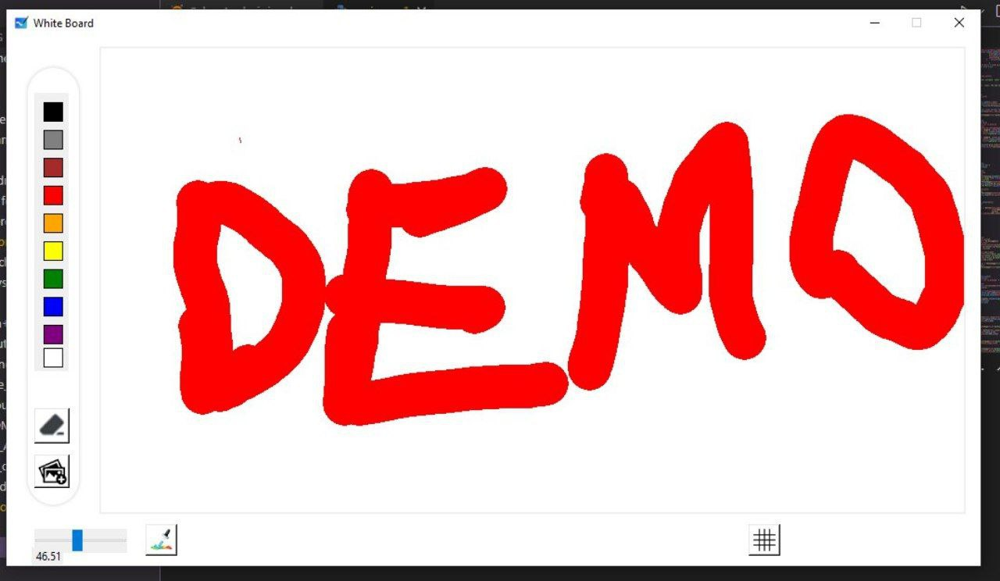

# White Board Application

The White Board Application is a simple drawing tool built using the Tkinter library in Python. It allows users to draw lines on a canvas, change the drawing color, toggle a grid for accurate drawing, and even import images onto the canvas. This README provides an overview of the application's features, installation instructions, and usage details.


## Features

- Draw lines on the canvas with various colors and line thickness.
- Toggle a grid for precise drawing and alignment.
- Choose colors from a predefined color palette or enter a custom hex color code.
- Import images onto the canvas and move them around.
- Clear the canvas to start fresh.

## Screenshots




## Demo

https://www.youtube.com/watch?v=kjXMk2vYDwM&feature=youtu.be


## License

[MIT](https://choosealicense.com/licenses/mit/)


## Authors

- [Arnab Mondal](https://www.github.com/codewarnab)


## Contributing

Contributions are always welcome!

See `contributing.md` for ways to get started.

Please adhere to this project's `code of conduct`.


## Run Locally

Clone the project

```bash
   git clone https://github.com/codewarnab/whiteboard.git
```

Go to the project directory

```bash
  cd whiteboard
```

Install dependencies
Install required dependencies (ensure you have Python and pip installed):

```bash
  pip install tk
```

run the application

```bash
  python whiteboard.py

```


## Usage/Examples


1.Launch the application using the installation steps mentioned above.

2.Draw lines on the canvas by clicking and dragging the mouse.

3.Use the color palette to choose drawing colors.

Toggle the grid for precise drawing.

4.Import images to the canvas and arrange them creatively.

5.Adjust line thickness using the slider.

6.Use the eraser tool to correct or clear sections.

7.Close the application window to exit.

